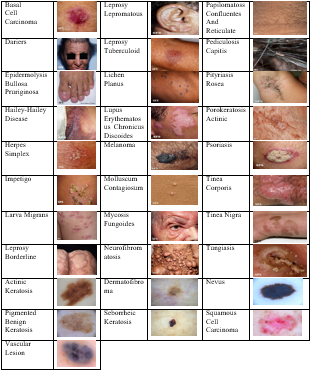

# EfficientSkinDis

## Web-Server
This repo contains source coude for *EfficientSkinDis* webserver, developed and deployed using Streamlit, which can be accessed on 

## Dataset
The dataset is available to access the 80:20 split on the 

### Sample-Dataset

